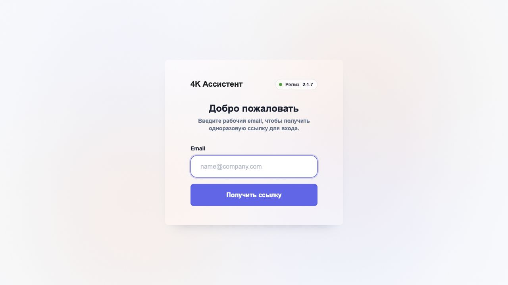
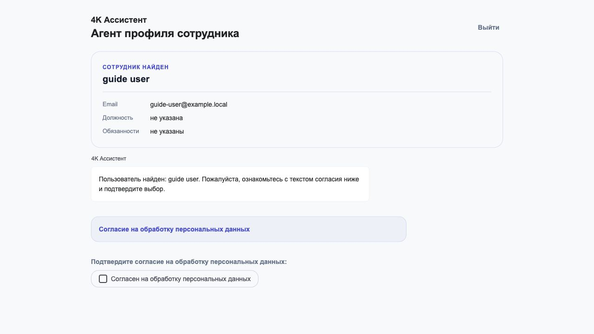
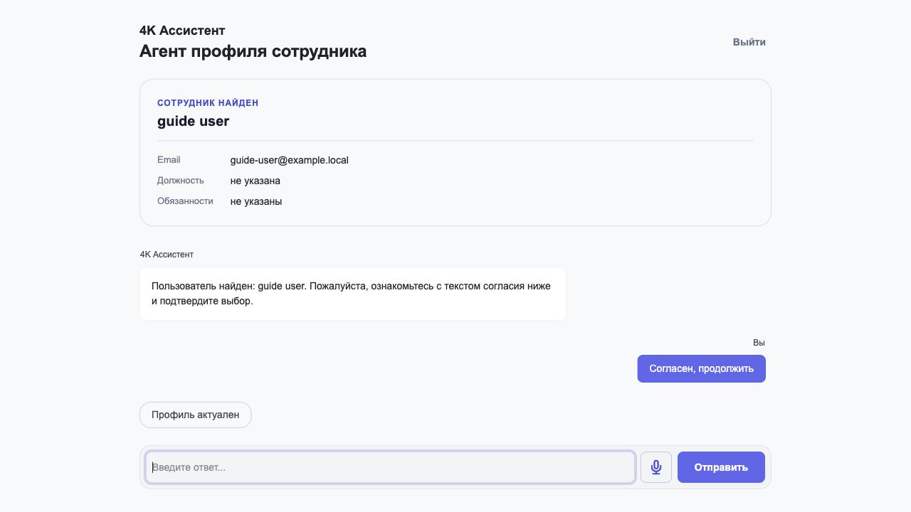
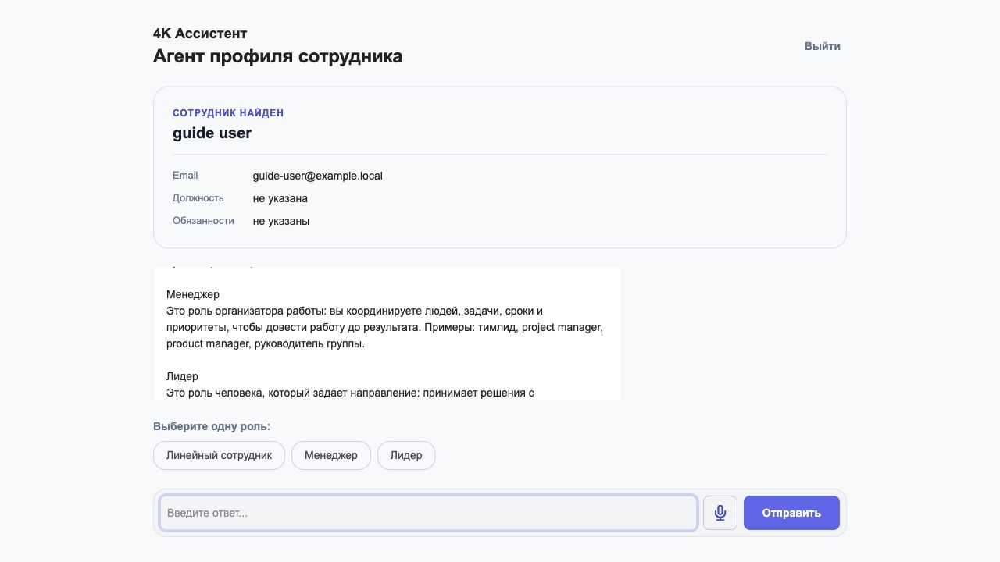
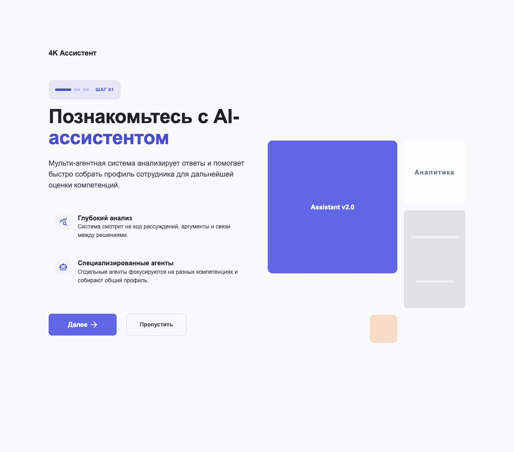
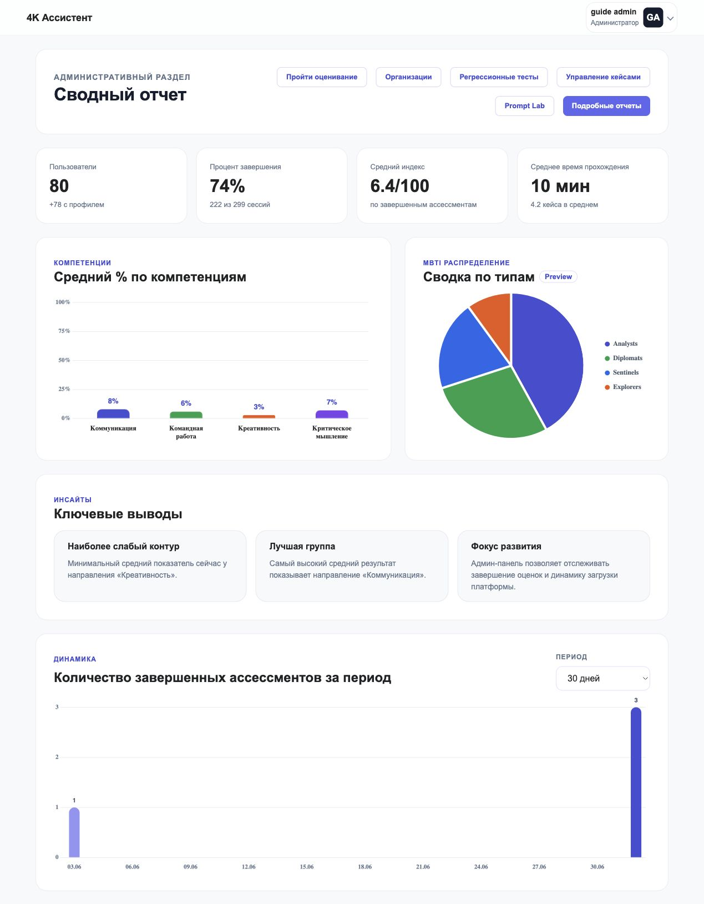
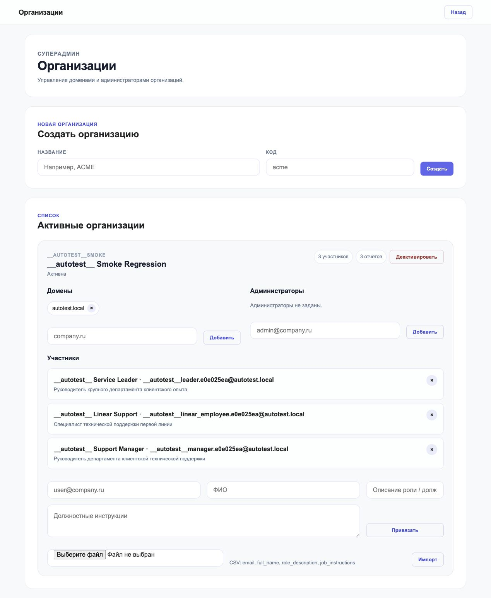
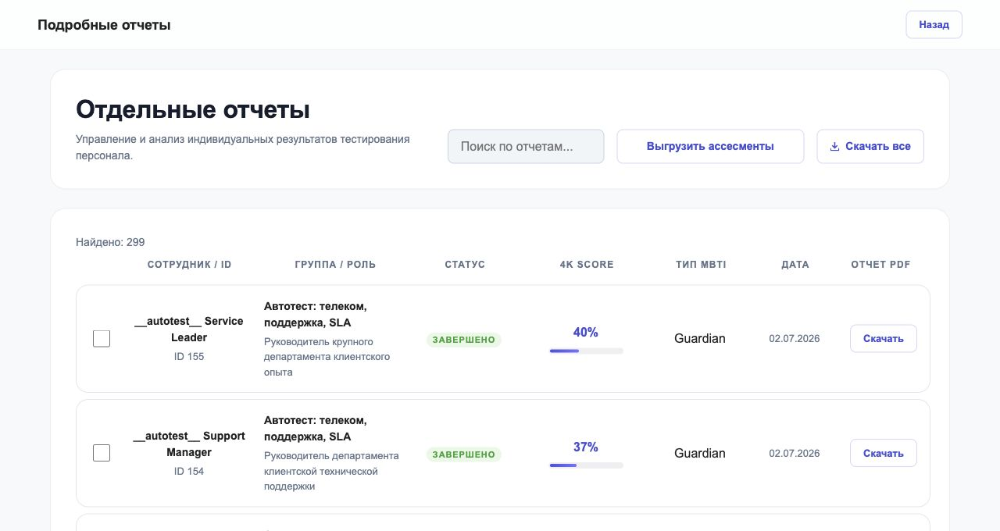
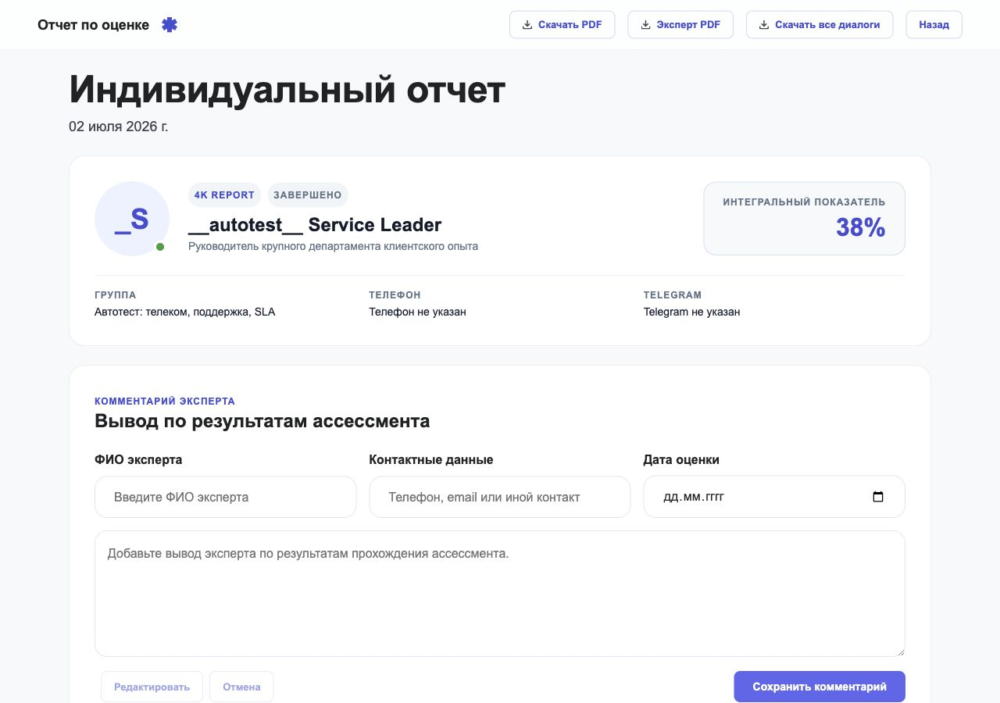

# 4K Ассистент: инструкция пользователя и администратора организации

Актуальный адрес системы: <https://pilot.4k-assistant.ru/>

Инструкция описывает два основных сценария:

- пользователь проходит оценивание и получает индивидуальный результат;
- администратор организации управляет участниками своей организации и смотрит отчеты.

## 1. Вход в систему

1. Откройте <https://pilot.4k-assistant.ru/>.
2. Введите рабочий email.
3. Нажмите **Получить ссылку**.
4. Откройте письмо и перейдите по одноразовой ссылке для входа.



Если ссылка не пришла, проверьте папку "Спам" или запросите новую ссылку. Старая ссылка после повторного запроса становится недействительной.

## 2. Инструкция для пользователя

### 2.1. Подтвердите согласие на обработку персональных данных

После входа система покажет профиль сотрудника и блок согласия. Перед началом работы нужно открыть текст согласия, ознакомиться с ним и нажать **Согласен на обработку персональных данных**.



### 2.2. Проверьте профиль

Система покажет известные данные: email, должность и обязанности. Если все верно, нажмите **Профиль актуален**. Если нужно исправить должность или обязанности, введите актуальный текст в поле ответа и отправьте его.



### 2.3. Выберите роль

Перед оцениванием выберите роль, которая лучше всего описывает вашу работу:

- **Линейный сотрудник**: выполняете конкретные задачи по правилам, инструкциям или стандартным процессам.
- **Менеджер**: координируете людей, задачи, сроки и приоритеты.
- **Лидер**: задаете направление, принимаете долгосрочные решения, ведете изменения.



### 2.4. Пройдите оценивание

Система последовательно задает вопросы и кейсы. Отвечайте в свободной форме: важно описывать ход рассуждений, аргументы, риски, действия и ожидаемый результат.

Рекомендации:

- пишите конкретно, как действовали бы в рабочей ситуации;
- не ограничивайтесь коротким ответом "да/нет";
- если система задает уточняющий вопрос, ответьте на него до перехода дальше;
- можно использовать кнопку диктовки, если в браузере разрешен микрофон;
- кнопка **Выйти** завершает текущую работу и возвращает на экран входа.



### 2.5. Завершение

После прохождения система формирует отчет. Если отчет не появился сразу, подождите несколько секунд: генерация может занимать время.

## 3. Инструкция для администратора организации

Администратор организации входит так же, как обычный пользователь: по рабочему email и одноразовой ссылке. После входа он попадает в административный раздел.

Администратор организации видит данные только своей организации. Суперадмин видит все организации.



### 3.1. Сводный отчет

На главном экране администратора доступны:

- количество пользователей;
- процент завершения оценивания;
- средний индекс;
- среднее время прохождения;
- распределение по компетенциям;
- распределение MBTI;
- динамика завершенных ассессментов за выбранный период.

Кнопка **Пройти оценивание** позволяет администратору самому пройти оценивание как участнику.

### 3.2. Управление участниками организации

Откройте раздел **Организации**. В нем можно управлять доменами, администраторами и участниками.



Для добавления одного участника заполните:

- email;
- ФИО;
- описание роли или должность;
- должностные инструкции.

Затем нажмите **Привязать**.

Для массовой загрузки используйте CSV-файл с колонками:

```csv
email,full_name,role_description,job_instructions
```

После выбора файла нажмите **Импорт**. Если пользователь с таким email уже есть, система не должна создавать дубль, а должна обновить или использовать существующую привязку.

### 3.3. Администраторы организации

В блоке **Администраторы** укажите email сотрудника и нажмите **Добавить**. После этого сотрудник сможет входить в административный раздел своей организации.

Если администратор также должен проходить оценивание, используйте кнопку **Пройти оценивание** из административного раздела.

### 3.4. Отчеты

Откройте раздел **Подробные отчеты**. Здесь можно:

- искать сотрудника;
- видеть статус прохождения;
- смотреть 4K score;
- видеть тип MBTI, если он сформирован;
- скачать PDF отчета;
- скачать несколько отчетов.



Нажмите на строку отчета, чтобы открыть индивидуальный отчет сотрудника.



В индивидуальном отчете доступны:

- общий результат;
- блок компетенций;
- MBTI-профиль, если он сформирован;
- персонализированный контекст пользователя;
- сильные стороны и зоны роста;
- материалы прохождения по кейсам;
- экспертный комментарий;
- скачивание PDF.

### 3.5. Удаление или деактивация организации

Если организация пустая, система удаляет ее. Если в организации уже есть пользователи или отчеты, организация деактивируется. Перед действием система должна запросить подтверждение.

## 4. Частые вопросы

### Пользователь не получил ссылку для входа

Проверьте правильность email и папку "Спам". Затем запросите ссылку повторно.

### Пользователь не видит организацию или попал не туда

Проверьте, что email пользователя добавлен в нужную организацию вручную, через CSV или через доменное правило организации.

### Администратор видит чужие данные

Это нештатная ситуация. Проверьте роль пользователя и его привязку к организации. Администратор организации должен видеть только свою организацию; все организации видит только суперадмин.

### Отчет не сформировался

Проверьте, что пользователь завершил кейсы. Если оценивание прервано, отчет может отсутствовать или быть в статусе "В процессе".

